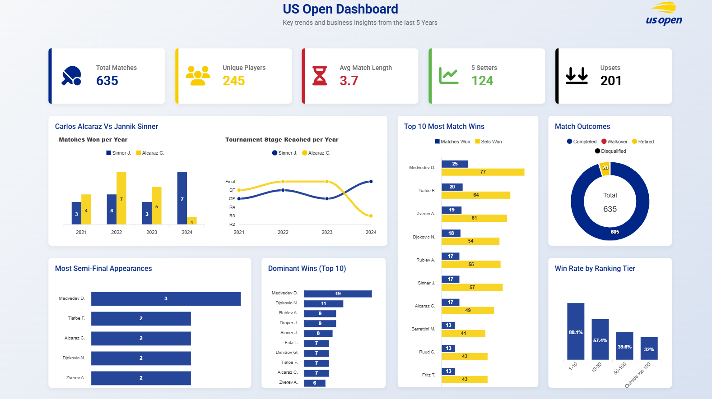

# US-Open-Dashboard
A dynamic and interactive dashboard visualizing key statistics and insights from the US Open tennis tournament. This project was inspired by my interest in tennis and the anticipation for the upcoming US Open.

### Overview

This dashboard provides a visual overview of various aspects of the US Open, including:

-   Total matches played
-   Number of unique players
-   Average match length
-   Number of five-set matches
-   Number of upsets
-   Head-to-head performance of Jannik Sinner and Carlos Alcaraz
-   Top 10 players with the most match wins
-   Distribution of match outcomes
-   Players with the most semi-final appearances
-   Top 10 players with the most dominant wins (straight sets with a significant game margin)
-   Win rate by player ranking tiers

### Data Source

The data for this dashboard was sourced from [football.co.uk](https://www.football.co.uk/), which provides a variety of sports data.

---

### Potential Improvements

The beauty of data analysis is the continuous opportunity for enhancement. Some improvements that can definitely be made:

-   **Interactive Filters:** Implement filters to allow users to explore data by specific years, players, or match rounds for a more personalized experience.
-   **Expanded Tournament Data:** Integrate data from other Grand Slam tournaments (Australian Open, French Open, Wimbledon) for a deeper, comparative analysis of player performance across different court surfaces and conditions.
-   **Deeper Player Statistics:** Add more granular data points like ace counts, unforced errors, and first serve percentage to enable a more detailed tactical analysis of matches.
-   **Predictive Analytics:** Explore the possibility of building basic predictive models based on historical data to forecast future match outcomes or player performance.
-   **Data Updates:** Implement a mechanism to automatically update the dashboard with new data as it becomes available (for future tournaments).

---

### Technologies Used

-   Google Apps Script
-   HTML
-   CSS
-   JavaScript
-   ApexCharts

View the dashboard via this [link]([https://www.football.co.uk](https://script.google.com/macros/s/AKfycbyHmeBUuxO4aLcjbmJHwpuJ89mc0F-QGBhO5RRIJkE/dev)/)

### License

This project is licensed under the [MIT License](LICENSE).
